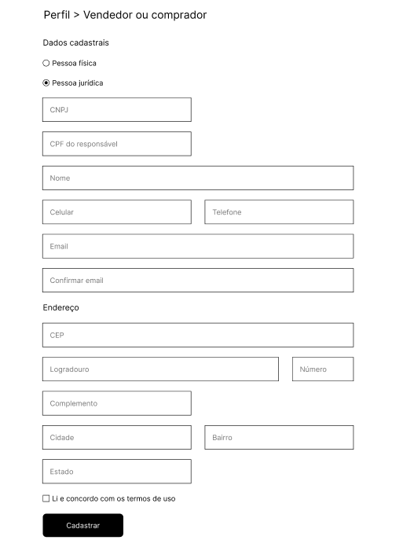

# WeFit Challenge - Formulário


## Descrição
Este projeto consiste em um endpoint que recebe os dados de um 
formulário contendo informações pessoais, de contato e endereço. 
O desafio propõe criar um endpoint que torne o formulário da imagem abaixo, funcionar corretamente.




##  Funcionalidades

- Cadastro de usuário com validações específicas para CPF/CNPJ, telefone e CEP
- Integração com a API [ViaCEP](https://viacep.com.br/) para preenchimento automático de endereço
- Persistência dos dados em banco de dados em memória (H2)
- Documentação dos endpoints com Swagger (OpenAPI)
- Tratamento global de exceções
- Testes de integração com MockMvc


## Tecnologias utilizadas

- Java 21
- Spring Boot
- Jakarta Validation (Bean Validation)
- Spring Data JPA
- Banco de dados H2
- Lombok
- Swagger (Springdoc OpenAPI)
- Arquitetura em camadas (VOs, DTOs, Services, Controllers)

## Banco de dados H2

Os dados são armazenados em um banco H2 em memória. Para acessar o console:

- URL: `http://localhost:8080/h2-console`
- JDBC URL: `jdbc:h2:mem:db`
- Username: `sa`
- Password: *(em branco)*


## Documentação da API

A documentação interativa está disponível em:

http://localhost:8080/swagger-ui.html

## Exemplo de requisição

### Requisição de cadastro de usuário:

POST http://localhost:8080/users

```json
{
  "type": "FISICA",
  "name": "João da Silva",
  "email": "joao@email.com",
  "cpf": "390.533.447-05",
  "cnpj": "",
  "phone": "(11) 3333-4444",
  "cellPhone": "(11) 98888-9999",
  "zipCode": "04547-000",
  "street": "Av. Paulista",
  "district": "Bela Vista",
  "number": "123",
  "city": "São Paulo",
  "complement": "Apto 45",
  "stateCode": "SP"
}
```

### Requisição de busca CEP

GET http://localhost:8080/address/04547000

### Resposta

```json
{
  "street": "Avenida Brigadeiro Faria Lima",
  "district": "Itaim Bibi",
  "city": "São Paulo",
  "state": "SP",
  "zipCode": "04547-000"
}
```

## Como executar o projeto localmente

1. Clonar o repositório
    * git clone https://github.com/caioandre182/wefit-challenge.git
    * cd wefit-challenge
    * ./mvnw spring-boot:run (Maven Wrapper)
    * mvn spring-boot:run (Caso tiver o Maven instlado)
